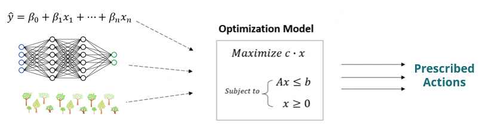
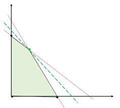
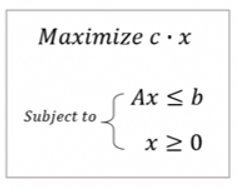

# Intro to Mathematical Optimization

## Workshop Introduction

Mathematical optimization is all about prescribing actions. Where ML problems focus on making predictions, optimization is focused on making recommendations. In short, when tackling an optimization problem, **the goal is to find decisions that maximize or minimize an objective function, while abiding by a set of underlying constraints**.  

Inputs to optimization problems can be outputs from upstream ML models or known values. Coefficients are given (e.g. c, A). We want to find out what X should be (our decision variables).  

Graphically, in a 2 decision (or 2 dimensional) problem we are trying to find an x,y pair that maximizes the value of the green dotted line while remaining within the feasible region that is defined by a set of inequalities (shaded area).   

There are many ways to solve optimization problems. We will cover two common approaches today: Heuristics and Mixed Integer Programming. Before jumping into these, a question you might be wondering about: can't we just try all possible solutions and select the best one? Yes, you can! But you may be sitting there for the rest of your life enumerating all possible solutions and seeing which ones are even feasible. The reality is that most decision problems have so many possible solutions such that efficiently enumerating and evaluating them is impossible.  

# Heuristics

A heuristic is any approach to solving a problem that uses a sufficiently practical method for finding solutions and offers a quick approximation of an optimal solution. However, it cannot be guaranteed that the solution returned is indeed optimal. 

Heuristics can be simple rules that are tried and true methods for solving a common problem. For example, if you wanted to minimize the chances of drinking sour milk, you might use the FIFO (first in first out) method in your refrigerator. There are countless rule-based heuristics. I have found [this book](https://mosaicatmgcc.sharepoint.com/:b:/r/sites/MosaicDataScience/Shared%20Documents/Data%20Science%20Workshops/Mathematical%20Optimization/HeuristicsBook.pdf?csf=1&web=1&e=Je0LUZ) to be a really helpful guide in discovering heuristic approaches that can be applied across different problem types. 

A broader class of heuristics (known as metaheuristics) are generalized methods that guide the search process, often helping to avoid falling into local optimums. While rule-based heuristics are often problem-specific, metaheuristics are generalized methods that can be applied across the board. Many metaheuristics fascinatingly are inspired by optimization processes that occur in nature. Examples include evolutionary algorithms, ant colony optimization, particle swarm optimization, and simulated annealing (which we will implement today).  

## Simulated Annealing
Annealing is a process in metallurgy in which a metal is heated above it's recrystallization temperature and then slowly cooled, allowing the molecules to settle into a more optimal formation. Today we will simulate that process and apply the same approach to solving a totally unrelated problem. 

Simulated Annealing (SA) will help us approximate the global optimum of today's objective function. A basic implementation of SA requires a few steps:

- 1: **An initial starting point.** This can be a random initial solution or the ouput of another heuristic (e.g. a greedy search method). 
- 2: **Finding a neighboring state.** A well-defined way of moving to another **feasible** solution within the solution space that is close to the current solution. 
- 3: **An objective.** A way of measuring the quality of a solution. 
- 4: **A solution acceptance criteria.** A way of deciding whether or not to accept a neighboring solution as the new current solution. This is where annealing and temperature comes in. Better solutions are always accepted. Worse solutions are probabalistically accepted based on the current temperature. The temperature starts out high and is lowered on a schedule. When the temperature is high, the probability of accepting a worse solution is high. As it is lowered, we move into local search. This allows us to search for a global optimum more widely before honing our search. 

 

The gif below shows an example of how simulated annealing is able to find the global maximum in this case. Were the search process to start on the left and only use a local search method, it would have become stuck in a local optima. 

 
 

# Mixed-Integer Programming

Mixed-Integer Programming (MIP) takes a strictly mathematical approach to optimization. This approach unlocks something key: guaranteed optimality. MIP models take an explict mathematical form, commonly generalized as:

The top row defines the objective function, followed by a series of inequalities that represent the constraints that prevent the objective from reaching infinity (or negative infinity in the case of minimization). The final set of constraints prohibit X from being negative. We refer to MIP as "mixed-integer", which simply means that some or all of the decision variables (X) need to be integral (not such an easy task). 

MIPs are an extension of Linear Programs (LP). LPs are optimization models that lack the integrality constraint. LPs can be solved much more efficiently, are commonly solved using an algorithm called the Simplex method, and are actually key to solving MIPs. MIPs are commonly solved using an algorithm called branch-and-bound. At a high level, B&B begins by relaxing the integrality restriction and solving what is known as the LP relaxation. If the solution to the LP relaxation is integral (meaning all decision variables are integer), then we have an optimal MIP solution. If not, we have an upper bound (maximizing) for how large our objective can get, although the LP relaxation is infeasible. Now we begin the search process by adding a constraint to force one variable to be integer. Enforcing this constraint creates new sub-problems that need to be solved. This will continue, creating a tree of sub-problems as we continue to restrict more variables to be integer. Along the way, we will discover feasible integer solutions (which may be optimal) and infeasible solutions. This information will help us close the known gap between our upper bound (LP relaxation) and lower bound (best found feasible solution) moving to be within some tolerance of optimality or reaching optimality (no gap). In the process, we won't necessarily need to solve all possible sub-problems (i.e. explore all possible solutions) because all sub-problems below an infeasible solution or a worse feasible solution can be chopped off. 

# Resources

## Heuristics

Scipy has some good implementations of heuristic approaches. However, heuristics typically need to be custom built and are very problem specific. 
https://docs.scipy.org/doc/scipy/index.html

This book has been very helpful in exploring heuristics for different common problem types.
https://mosaicatmgcc.sharepoint.com/:b:/r/sites/MosaicDataScience/Shared%20Documents/Data%20Science%20Workshops/Mathematical%20Optimization/HeuristicsBook.pdf?csf=1&web=1&e=Je0LUZ

 

## Mixed-Integer Programming

Gurobi has great documentation to help learn about optimization. They are also one of the leaders in optimization and have one of the fastest (if not the fastest) solvers. However it is not open source.
https://www.gurobi.com/

CVXPY is my favorite open source toolkit. Not going to be super fast and may require more work upfront to re-formulate your model to improve solve time. May work quickly if seeded with a good heuristic solution as a starting point.
https://www.cvxpy.org/index.html

Google OR-Tools is another option as well, but I can't speak to its efficacy yet. 
https://developers.google.com/optimization

This book was also helpful during my masters program.
https://mosaicatmgcc.sharepoint.com/:b:/r/sites/MosaicDataScience/Shared%20Documents/Data%20Science%20Workshops/Mathematical%20Optimization/Applied_Integer_Programming.pdf?csf=1&web=1&e=HocSqf